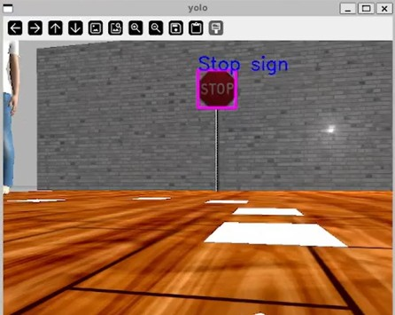
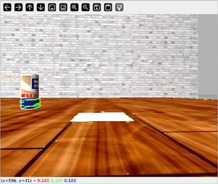
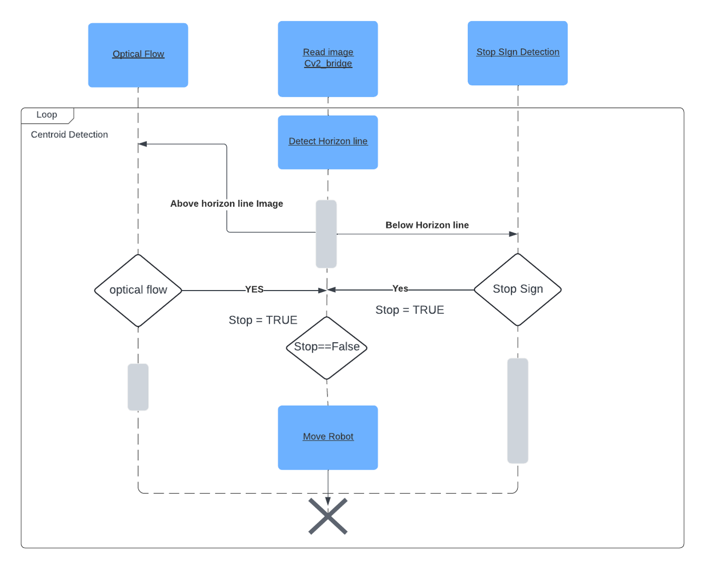

# ROS_2_TurtleBot_perception_project


## Prerequisites

- ROS 2 Humble
- Python 3 
- OpenCV
- PyTorch
- Torch
- Numpy
- Time
- Os

## Installation

### 1. Clone the Repository

```bash
mkdir -p ros_perception_ws/src
cd ~/ros_perception_ws/src

git clone https://github.com/ChandhanSaai/ROS_2_TurtleBot_perception_project.git

cd ~/ros_perception_ws

# build and install the package
export TURTLEBOT3_MODEL=waffle
source /opt/ros/humble/setup.bash 
colcon build --symlink-install 

```

### 2. Launch Gazebo World

```bash
source install/setup.bash
source  /usr/share/gazebo/setup.bash      ## this step may not be needed
ros2 launch enpm673_final_proj enpm673_world.launch.py "verbose:=true"

```

### 3. Run the Python Node
Open a new terminal and run the below command.
```bash
cd ~/ros_perception_ws
export TURTLEBOT3_MODEL=waffle

source install/setup.bash
ros2 run enpm673_final_proj enpm673_final_proj_main.py
```
## Output
- Gazebo_implementation
- 

- Real World Implementation

- Stop Sign detection
- 

- Horizon line detection
- 

- Optical flow



## System flow

